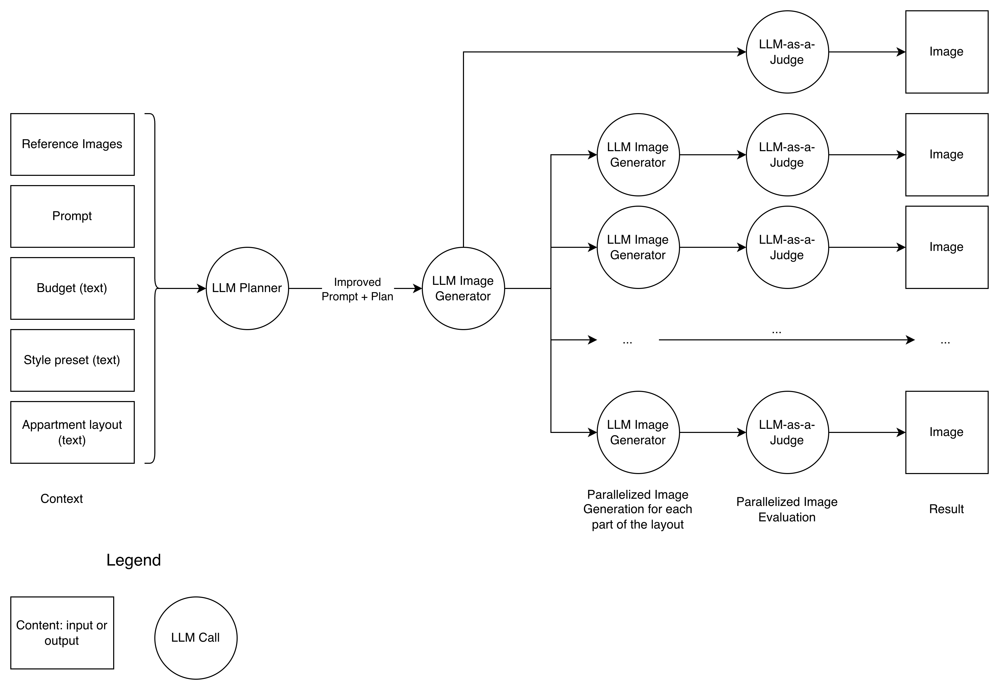

The solution is tasked to generate interier design based on user's textual preferences and source image. As input the program takes text + image and outputs multiple images representing different parts of user's appartments + JSON report file with details. The details include token usages, costs, recorded automated metrics, and durations of each operations. 

The `README.md` has the following sections:
* **solution-outline** - I explain what was built and how
* **how-to-run** - I give the commands to run the solution
* **implementation** - details of development
* **future-work** - here I reflect on what can be done in the future to improve the solution, but it was not done because of the time limits

## Solution outline


### Input data
The application starts with gathering inputs. I take an image from user, potentially images in the future (see **Future Work** section). Additionally, budget information, style preset, appartment information extracted from the textual prompt (see **Future Work** section for more details). 

### LLM Planner
All aggregated information is passed to the AI workflow implemented using **LangGraph**. There the entrance node is **LLM Planner** that does prompt augmentation making the prompt more appropriate for the system and determines how many images I need to generate. Here I implemented the app that will give multiple images of the appartments from different rooms, such that **LLM Planner** determines its number and writes the detailed explanation for each of them.

### Reference image generation
I must ensure that the pictures follow the same style of appartments giving the consistent final result. However, I need to understand that the image, given by user, is not that reference, because it can be whatever he wants to put in context: drawings, plans, screenshots, and ideas.

I need to have a first canonical image based on which the rest will be generated.

### Parallel image generation
After the reference is prepared, I run concurrently generation of the rest of images. 

### Evaluation
I calculcate automated metrics from every single image generation using LLM-as-a-Judge.

Exploring eval metrics is an iterative process, such that I picked initial list based on my intuition:
* **Budget correspondece** - how given interier at the picture is doable for the budget given by a user.
* **General prompt correspondence** - how picture matches the prompt
* **Realism** - how it's real to do it 
* **Satisfaction** - how pleasent it is
* **Usability** - how usable it is for living

The given metrics were selected based on my intuition. More details are included at **Future Work** section.

### Report 

I store all the generated images with semantically proper names for them as well as the request and the report. The report includes durations in seconds for every LLM generation including planning, image generation, and evaluations, also planner, and all the evaluation results. it also contains token usage information for each independent AI model with transformed infromation to costs using **LiteLLM**.

### Complexity

Because of the solution's workflow required complexity, the **Graph** architecture was the best option. I built it using **LangGraph**. However, I came to this decision iteratively after hours of planning and development. Modules such as LLM planner and LLM evaluator didn't come at the first day. To remember past times, the first version of solution was built in a single service.

### Other
I did not implement **RAG (Retrieval-augmented-generation)**, nor use **vector databases** because it's architecturally redundant point to provide high-quality interier design images. The images and results are stored locally in the file system as a good starting point.

## How to run

1. Clone **Git** repo 
    ```
    git clone git@github.com:montarelab/interior_ai.git
    ```

2. Open the folder
    ```
    cd interior_ai
    ```

3. Install packages
    ```
    uv sync
    ```
4. Create `.env` file for environments
    ```
    cp .env.example .env
    ```
5. Fill enviroment variables in `.env`.

6. Run **Docker daemon**

7. Run app
    ```
    docker compose up
    ```

- (Optionally) Run app locally
    ```
    uv run python -m src.main
    ```

## Implementation

### Libraries used
* `fastapi` - API development
* `langchain`, `langgraph`, `jinja2` - workflow graph construction, template rendering
* `litellm` - LLM automatic costs calculation
* `openai`, `google-genai` - image geneation API of **OpenAI** and **Google**, because **LangChain**/**LiteLLM**/**others** are either poor, either not-asynchronous, or not working for image gen.
* `aiofiles`, `pydantic` - productivity: async file operations and validated models development.

The solution is containerized using **Docker** to support running in different environments. It's imporatant to state API's host and port inside environment variables. Additionally, you can update models used for evluation, planning, image generation, and add LLM API keys. 

### API Design
* `/generate` - POST endpoint that generates interier images and report. Takes image and textual prompt as input. It returns path for the results.
* `/evaluate` - POST endpoint that evaluates the system based on given data: AI models to use, tasks, versions of tasks.

### Dataset and tasks
* Dataset is used for evaluation. There are 5 **tasks** inside the dataset, where each corresponds to unique interier style. 
* There are 6 files inside each **task-folder**: source reference image and 5 versionized prompts. 
* Each task input simulates user's prompt, even though the prompts are written with **Markdown**, they are structured and contain all the details exlicitly. 
* The version of prompt determines how specific the user's request is, where 1 - specific, and 5 - vague.

### Project structure
* `src` - all the **Python** modules necessary for API.
    * `main.py` - main executive point with **FastAPI** app.
    * `graph.py` - main app's workflow built with **LangGraph**.
    * `models.py` - **Pydantic** models used for development.
    * `settings.py` - structured, validatable environment variables accessor.
    * `utils.py` - extra functions including token usages compouning, data type converters, and prompt render functionality.
* `dataset` - includes 5 **tasks** for the system for each unique style. (see **Dataset and tasks**)
* `prompts` - **Jinja2** prompt templates used for AI. They include `plan`, `img_gen`, and `eval` for the corresponding stages of work. Additionally, there is `dataset_gen.jinja` that I used to generate the initial dataset used for my own evaluation. There are no parts of the workflow that use it, but I used it my own and added here to keep and version once it will be needed.
* `jobs` - system results. Each folder inside is an exact rn of `/generate` or `/evaluate` determined as request's datatime + `UUID` ID. I store both request and response inside.
* `images` - images used in **README.md**

### LLM models support
urrent solution supports only **Google** and **OpenAI** models because there are no unified API for any **any-to-image** AI model provider, while writing my own would be too expensive. I chose these providers as they have flag-ship models.(see **Future work** section)


### Model preferences
* Image generation: **gemini-2.5 (Nano Banana)** - gave me the most pleasent results. It is not that fast, but the quality of details is high. Additionally it gives much less halucinations than `gpt-image-1-mini` and `gpt-image-1.5`, and the outputs are more realistic. Moreover, it's not that long as `gemini-3-pro-image-preview`
* Planner LLM and Eval LLM - `gpt-5-mini` with minimal reasoning to ensure the stages are processing fast. The current task does not seem to be heavy on LLM's thinking capabilities, such that light and fast models can be used.

Overall, the time for generation of image can be around 175 seconds or 2.5 minutes or:
* 35s for planning
* 55 sec for 1st image
* 55 sec for the rest of images
* 30 sec for evaluation

## Future work

* Application input may take only image or only text. It can take multiple number of images. Such freedom would enhance app's flexibility.
* It's impossible to ensure that the user will give budget, style preset, appartment information, or that this information will be exact and understandable for the system. I was reflecting that upgrading UX by detecting improper for our system text inputs and reask the user would be improve input, and output, as a result.
* As the given evaluation metrics were sleected based on my intuition and in the scope of the first steps, more metrics will be inevitably discovered. Evaluation metrics exploration is a very iterative process. More tests need to be done, more discoveries, and more metrics.
* It would be great to support multiple model providers including **Qwen**. Writing adapters to the current system is simple, but needs to be proved.